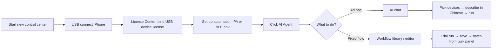

# UI preview & onboarding path

:::note About screenshots

If your local UI differs slightly, trust the **new control center 10.1.0+** actual interface.

:::

## Main screens

### AI chat

Describe tasks in Chinese; pick devices and workflows on the left, then run.

 

### Workflow editor

Visual flowchart, trial run, variable pool, and AI-assisted authoring.

### Tasks & monitoring

View per-device progress during batch runs; pause and resume supported.

## 30-second onboarding path

Detailed steps:

1. [Prerequisites & licensing](./prerequisites) — USB license + runtime environment
2. [Getting started](./getting-started) — open window, configure model, pick devices
3. [AI chat](./ai-chat) or [Workflow editor](./workflow-editor)

## Related docs

- [Overview & index](/iosdocs/advance/ai-agent/)
- [Troubleshooting](./troubleshooting)
