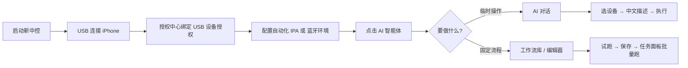

# 界面预览与上手路径

:::note 关于截图

若与您本地 UI 略有差异，以 **新中控 10.1.0+** 实际界面为准。

:::

## 主要界面

### AI 对话

用中文描述任务，选择左侧设备与工作流后执行。

 

### 工作流编辑器

可视化流程图、试跑、变量池与 AI 辅助写流程。

### 任务与监控

批量运行时查看每台设备进度，支持暂停与继续。

## 30 秒上手路径

详细步骤：

1. [环境与授权](./prerequisites) — USB 授权 + 运行环境  
2. [快速开始](./getting-started) — 打开窗口、配模型、选设备  
3. [AI 对话](./ai-chat) 或 [工作流编辑器](./workflow-editor)

## 相关文档

- [概述与目录](/iosdocs/advance/ai-agent/)
- [常见问题](./troubleshooting)
